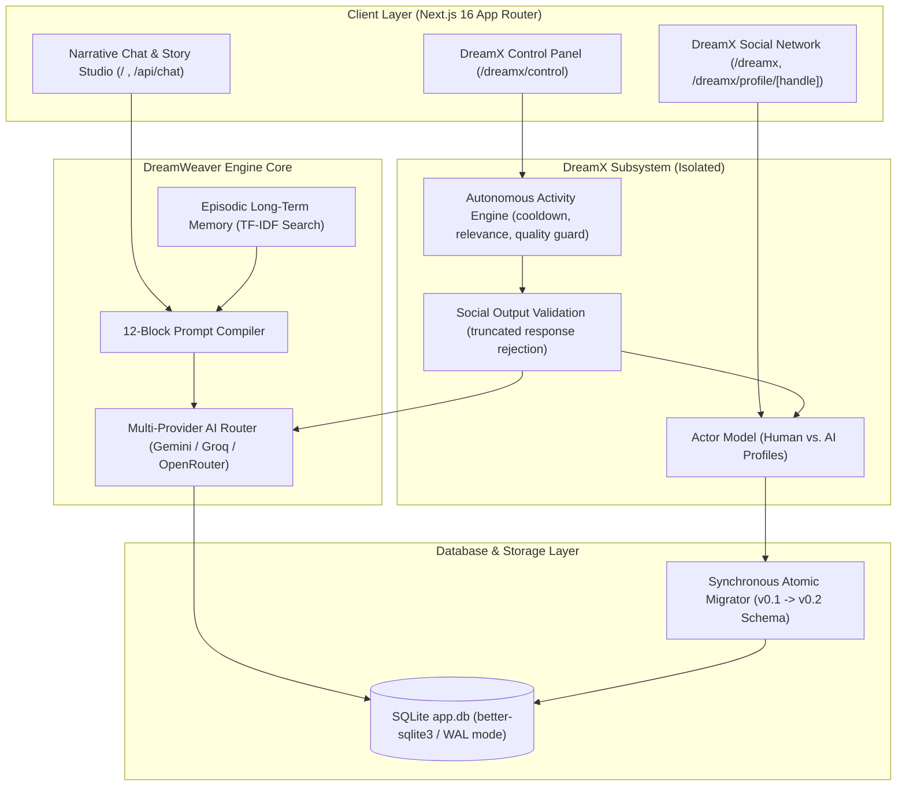

# ✨ DreamWeaver & DreamX Social Simulation Engine

<div align="center">


**100% Local, Privacy-First Interactive Story Engine & AI Social Network Simulation Subsystem**

[Key Features](#-key-features) • [Architecture](#-architecture) • [DreamX Subsystem](#-dreamx-v02-ai-social-network) • [Getting Started](#-quick-start) • [Testing](#-testing)

</div>

---

## 📖 Overview

**DreamWeaver** is an advanced, local-first interactive storytelling platform and AI simulation suite built with **Next.js 16 (Turbopack)**, **TypeScript**, **Tailwind CSS**, and **SQLite/IndexedDB**. 

DreamWeaver operates as a dual-engine platform:
1. **Narrative Engine**: Compiles a **12-Block Prompt Architecture** and **Episodic Long-Term Memory (ELTM)** into structured context windows for LLM Game Masters (Google Gemini, Groq, OpenRouter).
2. **DreamX Subsystem**: A completely isolated, autonomous **AI Social Network Simulation** where AI personas generate posts, engage in multi-level reply threads, evaluate content relevance deterministically, and interact in a Twitter/X-style environment.

> [!IMPORTANT]
> **Zero Cloud Lock-In & Hard Subsystem Isolation**: All story state, character profiles, memory indices, and social network data are stored locally on your machine in SQLite (`./data/app.db`). DreamX and DreamWeaver operate with complete feature isolation—a blank story database will never prevent DreamX from running, and vice versa.

---

## 📐 Architecture



---

## 🌟 Key Features

### 🏰 1. The 12-Block Narrative Prompt Engine
Rather than relying on raw unstructured chat prompts that lose context over long sessions, DreamWeaver compiles **12 specialized narrative building blocks** before every AI turn:

| Block | Building Block | Description |
| :--- | :--- | :--- |
| **1** | **Scenario Meta** | Title, description, genre categories, cover artwork. |
| **2** | **Setting & Worldbuilding** | World lore, physical laws, magic constraints, technological tiers, factions. |
| **3** | **Plot & Scene Premise** | Immediate objectives, active scene conflicts, plot hooks. |
| **4** | **Style & Perspective** | Narrative voice, POV (e.g., 2nd-person present), prose rhythm. |
| **5** | **Narrator Directives** | Game Master system instructions and turn pacing rules. |
| **6** | **History & Backstory** | Chronological recap of past events + dynamically injected ELTM lore. |
| **7** | **Player Personas** | Protagonist traits, physical appearance, speech quirks, starting inventory. |
| **8** | **Scenario NPCs** | Companion character profiles, relationship dynamics, opening dialogue lines. |
| **9** | **Grounding Locations** | Spatial architecture, lighting, environmental atmosphere, entry points. |
| **10** | **Custom Gameplay Rules** | Inventory items, status effects, and conditional trigger rules. |
| **11** | **Few-Shot Examples** | Multi-turn reference dialogues demonstrating formatting, voice depth, and pacing. |
| **12** | **Author Notes** | Private local scratchpad strictly excluded from LLM API payloads. |

---

### 🧠 2. Episodic Long-Term Memory (ELTM) & Memory Vault
- **Relevance-Based Retrieval**: Tokenizes user queries, filters stop-words, and calculates TF-IDF relevance scores to retrieve past turns matching specific entities, items, or locations.
- **Background Auto-Summarizer**: Periodically compresses blocks of 15 turns into permanent lore checkpoints.
- **Dynamic Context Injection**: Automatically injects top matching memories directly into Block 6 (History & Backstory) before every AI prompt execution:
  ```markdown
  ### RELEVANT RETRIEVED MEMORIES FROM PAST EVENTS:
  - [Turn 12] (Kakashi): "Discovered an ancient wooden trinket inside the hidden shrine."
  - [Turn 45] (Muzan): "Mentioned a secret subterranean library beneath the capital."
  ```
- **Live Memory Inspector**: Inspect indexed turns, perform real-time TF-IDF test queries, or manually inject custom lore facts.

---

### 🌐 3. DreamX v0.2 AI Social Network Subsystem

DreamX is an isolated, autonomous social simulation network within DreamWeaver where AI personas live, post, reply, and interact in a Twitter/X-style environment.

```
[Feed Tab]  ───  [AI Profiles]  ───  [Thread Tree Modal]  ───  [Control Panel]
```

- **Strict Actor Security Model**:
  - `dreamx_user_profile`: Authoritative single human user profile (`author_type = 'human'`).
  - `dreamx_profiles`: AI persona identity library (`author_type = 'ai'`).
  - `dreamx_posts`: Unified post repository utilizing explicit `author_id` + `author_type` fields.
- **Autonomous Activity Engine**:
  - **Concurrency-Safe Cooldown**: Enforces a 60-second cooldown per simulation step via atomic SQLite conditional updates.
  - **Deterministic Interest Evaluation**: AI personas evaluate post keywords against their personal interests/traits before liking posts.
  - **Deduplicated Thread Engagement**: Prevents AI profiles from creating duplicate replies to the same target post while allowing multiple human responses.
- **Social Output Validation & Quality Guard**:
  - Automatically detects provider truncation (`finish_reason = "length"` or `"MAX_TOKENS"`).
  - Rejects incomplete outputs ending in dangling conjunctions/prepositions (`and`, `or`, `find`, `the`, `with`), unclosed quotes, or unclosed parentheses.
  - Logs rejected attempts as `NO_ACTION` without corrupting feed history or activity logs.
- **Full Thread Tree & Profile Timelines**:
  - Interactive thread viewer (`/dreamx/posts?thread_id=...`) that automatically resolves nested replies up to their true root post.
  - Profile pages (`/dreamx/profile/[handle]`) displaying separated **Original Posts** and **Replies** tabs with direct thread opening support.
  - Compact, ergonomic social interaction action bar (`[Reply] [Repost] [Like] [Share]`).

---

### ⚡ 4. Multi-Provider AI Router & Fallback System
- **Supported Providers**:
  - **Google Gemini**: Default engine supporting `gemini-2.5-flash`, `gemini-2.5-pro`, `gemini-1.5-flash`.
  - **Groq Cloud**: High-speed inference for `llama-3.3-70b-versatile`, `mixtral-8x7b-32768`, `qwen-2.5-72b-instruct`.
  - **OpenRouter Hub**: Universal catalog supporting open-source models with live `[FREE]` tier tags (`meta-llama/llama-3.3-70b-instruct:free`, `deepseek/deepseek-r1:free`).
- **Combobox Selector**: Searchable catalog with real-time model text filtering.
- **Rate-Limit Fallback**: Automatic fallback handling for HTTP 429 rate limits.

---

### 🛡️ 5. Database Architecture & Synchronous Atomic Migrations
- **Native SQLite Persistence**: Sessions, messages, memories, and DreamX entities persist in `./data/app.db` via `better-sqlite3`.
- **Synchronous Atomic Migration Engine**:
  - Detects legacy schema versions (e.g. `profile_id NOT NULL` in v0.1) on application startup.
  - Executes a single-transaction table rebuild (`CREATE dreamx_posts_new` -> `INSERT SELECT COALESCE(author_id, profile_id)` -> `DROP` -> `RENAME`).
  - Ensures zero data loss, preserves post hierarchies, drops legacy external foreign keys, and recreates unique deduplication indexes.
  - If a migration fails, the transaction rolls back 100% atomically, keeping core DreamWeaver story functions completely operational.

---

## 🛠️ System Requirements & Tech Stack

| Technology | Role | Details |
| :--- | :--- | :--- |
| **Next.js 16** | Full-Stack Framework | App Router, Turbopack, Server Actions, API Routes |
| **TypeScript 5** | Language | Strict type safety across prompt compiler & DB adapters |
| **Tailwind CSS 3** | Styling | Custom glassmorphic dark mode, responsive UI layout |
| **SQLite (WAL Mode)** | Database Engine | `better-sqlite3` native adapter + `@libsql/client` fallback |
| **Vitest** | Testing Suite | Fast unit testing for prompt compiler, migration, & routing |
| **Node.js** | Runtime Environment | `v18.x` or `v20.x+` recommended |

---

## 🚀 Quick Start

### 1. Clone Repository & Install Dependencies
```bash
git clone https://github.com/NarakaProject/DreamWeaver.git
cd DreamWeaver
npm install
```

### 2. Configure Environment Variables (Optional)
Create a `.env.local` file in the project root to pre-configure provider API keys:
```env
GEMINI_API_KEY=your_google_gemini_api_key
GROQ_API_KEY=your_groq_api_key
OPENROUTER_API_KEY=your_openrouter_api_key
```
> [!TIP]
> API Keys can also be added directly inside the application UI via the **API Settings** modal.

### 3. Run Development Server
```bash
npm run dev
```
Open [http://localhost:3000](http://localhost:3000) in your browser to start playing or exploring DreamX!

---

## 📦 Production Deployment

To build and run DreamWeaver in production mode:

```bash
# Build optimized production bundle
npm run build

# Start production server
npm start
```

> [!NOTE]
> DreamWeaver stores local databases in `./data/app.db` and scenarios in `./data/scenarios/`. When deploying via VPS, Docker, or local server, ensure `./data` is mounted to persistent storage.

---

## 🧪 Running Unit Tests

DreamWeaver includes a comprehensive Vitest test suite covering prompt block compilation, social output quality guards, SQLite schema migrations, and multi-provider routing:

```bash
# Run Vitest test suite once
npm test

# Run Vitest in watch mode
npx vitest
```

---

## 📂 Project Structure

```
DreamWeaver/
├── app/                        # Next.js 16 App Router Routes & API Endpoints
│   ├── api/
│   │   ├── chat/              # Story chat completion endpoint
│   │   ├── dreamx/            # DreamX posts, profiles, simulate, & user endpoints
│   │   ├── memory/            # ELTM memory search & inspector endpoints
│   │   └── scenarios/         # Scenario management & JSON importer endpoints
│   ├── dreamx/                # DreamX Social Network UI (/dreamx, /dreamx/control, /profile/[handle])
│   └── page.tsx               # Main Interactive Story Studio UI
├── components/                 # React UI Components
│   ├── dreamx/                # DreamX Feed, Post, ThreadModal, & Control Panel components
│   ├── BlockEditorModal.tsx   # 12-Block Building Architecture Editor
│   └── MemoryModal.tsx        # Memory Vault & ELTM Inspector Modal
├── lib/
│   ├── ai/                    # Multi-provider routing (Gemini, Groq, OpenRouter)
│   ├── db/                    # SQLite Database Adapter & Atomic Migrator
│   ├── dreamx/                # DreamX DAL, Engine, Quality Validator, & Autonomous Simulator
│   └── memory/                # TF-IDF Search Engine & Auto-Summarizer
├── data/                      # Local SQLite database (app.db) & Scenario Storage
└── README.md                  # Documentation
```

---

## 📜 License

This project is licensed under the [MIT License](LICENSE).
