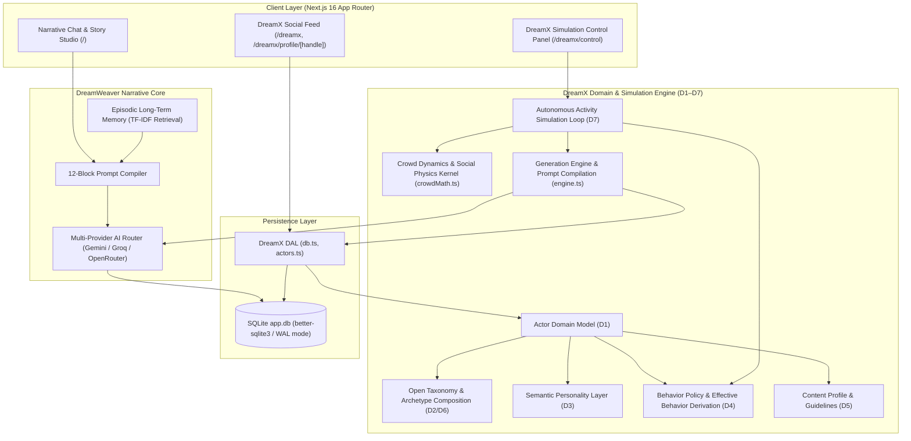

# ✨ DreamWeaver & DreamX Social Simulation Engine

<div align="center">


**100% Local, Privacy-First Interactive Story Engine & Autonomous AI Social Network Simulation Platform**

[Key Features](#-key-features) • [DreamX Architecture (D1–D7)](#-dreamx-domain-architecture-d1d7) • [Getting Started](#-quick-start) • [Testing & Verification](#-testing--verification) • [Contributing](#-contributing--governance)

</div>

---

## 📖 Overview

**DreamWeaver** is an advanced, local-first interactive storytelling platform and AI simulation suite built with **Next.js 16 (Turbopack)**, **TypeScript**, **Tailwind CSS**, and **SQLite**.

DreamWeaver operates as a dual-engine platform:
1. **Narrative Engine**: Compiles a **12-Block Prompt Architecture** and **Episodic Long-Term Memory (ELTM)** into structured context windows for LLM Game Masters across multiple providers (Google Gemini, Groq Cloud, OpenRouter).
2. **DreamX Subsystem**: A fully isolated, autonomous **AI Social Network Simulation** where AI personas generate posts, engage in multi-level reply threads, evaluate content relevance deterministically, and interact in a Twitter/X-style environment governed by mathematical social physics and layered actor domain models.

> [!IMPORTANT]
> **Zero Cloud Lock-In & Subsystem Isolation**: All story state, character profiles, memory indices, and social network data persist locally in SQLite (`./data/app.db`). DreamX and DreamWeaver operate with complete feature isolation—a blank story database will never prevent DreamX from running, and vice versa.

---

## 📐 High-Level Architecture



---

## 🏛️ DreamX Domain Architecture (D1–D7)

DreamX models social actors as decoupled domain aggregates rather than monolithic objects:

```
Actor
├── identity       (D1: id, handle, display_name, actor_type, verification_type)
├── taxonomy       (D2/D6: category, archetypes, tags)
├── personality    (D3: summary, traits, interests, beliefs, background)
├── contentProfile (D5: style, topics, patterns, guidelines, bias)
└── behaviorPolicy (D4: actionProbabilities, engagementSelectivity)
```

| Phase | Domain Component | Module | Responsibility |
| :--- | :--- | :--- | :--- |
| **D1** | **Actor Domain Model** | [`lib/dreamx/actors.ts`](lib/dreamx/actors.ts) | Pure compositional aggregate mapping database records to `Actor` objects without God Object anti-patterns. |
| **D2** | **Open Actor Taxonomy** | [`lib/dreamx/taxonomy.ts`](lib/dreamx/taxonomy.ts) | Data-driven categories and archetypes with dynamic registry and safe fallback definitions. |
| **D3** | **Personality Layer** | [`lib/dreamx/personality.ts`](lib/dreamx/personality.ts) | Pure semantic identity data (summary, traits, interests, beliefs, lore) for LLM prompts; never direct simulation math. |
| **D4** | **Behavior Policy** | [`lib/dreamx/behaviorPolicy.ts`](lib/dreamx/behaviorPolicy.ts) | Probabilistic action selection (`like`, `reply`, `post`, `no_action`), selectivity, and canonical `deriveEffectiveBehavior()`. |
| **D5** | **Content Profile** | [`lib/dreamx/contentProfile.ts`](lib/dreamx/contentProfile.ts) | Semantic speaking/writing style, topics, formatting patterns, and posting guidelines. |
| **D6** | **Archetype Composition** | [`lib/dreamx/taxonomy.ts`](lib/dreamx/taxonomy.ts) | Deterministic, deduplicated, order-preserving composition of multiple archetype IDs. |
| **D7** | **Simulation Integration** | [`lib/dreamx/simulation.ts`](lib/dreamx/simulation.ts) | Autonomous AI simulation loop, urgency event detection, weighted candidate selection, and prompt compilation in [`engine.ts`](lib/dreamx/engine.ts). |

### Strict Actor Execution Invariants
- **`actor_type` is strictly `'human' | 'ai'`**: Social categories (`celebrity`, `media`, `novelty`, `institution`, etc.) live in Taxonomy, never in `actor_type`.
- **Human Non-Autonomy**: Human user profiles have `actor_type: 'human'` and `behaviorPolicy: undefined`, ensuring human accounts are never autonomously driven by the simulation loop.
- **Zero Account-Type Hardcoding**: Generation and simulation logic consume domain metadata rather than hardcoded `if (category === 'celebrity')` branches.

---

## 🌟 Key Features

### 🏰 1. The 12-Block Narrative Prompt Engine
Rather than relying on unstructured chat prompts that lose context over long sessions, DreamWeaver compiles **12 specialized narrative building blocks** before every AI turn:

| Block | Building Block | Description |
| :--- | :--- | :--- |
| **1** | **Scenario Meta** | Title, description, genre categories, cover artwork. |
| **2** | **Setting & Worldbuilding** | World lore, physical laws, magic constraints, technological tiers, factions. |
| **3** | **Plot & Scene Premise** | Immediate objectives, active scene conflicts, plot hooks. |
| **4** | **Style & Perspective** | Narrative voice, POV (e.g., 2nd-person present), prose rhythm. |
| **5** | **Narrator Directives** | Game Master system instructions and turn pacing rules. |
| **6** | **History & Backstory** | Chronological recap of past events + dynamically injected ELTM lore. |
| **7** | **Player Personas** | Protagonist traits, physical appearance, speech quirks, starting inventory. |
| **8** | **Scenario NPCs** | Companion character profiles, relationship dynamics, opening dialogue lines. |
| **9** | **Grounding Locations** | Spatial architecture, lighting, environmental atmosphere, entry points. |
| **10** | **Custom Gameplay Rules** | Inventory items, status effects, and conditional trigger rules. |
| **11** | **Few-Shot Examples** | Multi-turn reference dialogues demonstrating formatting, voice depth, and pacing. |
| **12** | **Author Notes** | Private local scratchpad strictly excluded from LLM API payloads. |

---

### 🧠 2. Episodic Long-Term Memory (ELTM) & Memory Vault
- **Relevance-Based Retrieval**: Tokenizes user queries, filters stop-words, and calculates TF-IDF relevance scores to retrieve past turns matching specific entities, items, or locations.
- **Background Auto-Summarizer**: Periodically compresses blocks of turns into permanent lore checkpoints.
- **Dynamic Context Injection**: Injects top matching memories directly into Block 6 (History & Backstory) before every AI prompt execution.
- **Live Memory Inspector**: Inspect indexed turns, perform real-time TF-IDF test queries, or manually inject custom lore facts.

---

### 🌐 3. DreamX Social Simulation & Physics Kernel
- **Autonomous Activity Loop**:
  - Concurrency-safe atomic cooldown claim (60 seconds) via SQLite.
  - Scan for high-urgency social events (e.g. human replies or explicit `@handle` mentions).
  - Effective policy derivation via canonical D4 `deriveEffectiveBehavior()`.
  - Non-LLM deterministic like evaluation based on actor interests and content topics.
- **Social Physics & Crowd Dynamics** ([`lib/dreamx/crowdMath.ts`](lib/dreamx/crowdMath.ts)):
  - Mathematical models for multi-tier impression propagation, virality cascades, follow-rate dampening, and sentiment equilibrium.
- **Quality Guard & Output Normalization**:
  - Automatically detects provider truncation and rejects outputs with dangling conjunctions or unclosed quotes.
  - Logs rejected generations as clean `NO_ACTION` activity entries.
- **Full Thread Tree & Timeline Navigation**:
  - Deep-linkable thread tree modal resolving parent/child reply chains.
  - Profile pages (`/dreamx/profile/[handle]`) separating original posts and replies.

---

### ⚡ 4. Multi-Provider AI Router
- **Google Gemini**: Default engine (`gemini-2.5-flash`, `gemini-2.5-pro`, `gemini-1.5-flash`).
- **Groq Cloud**: High-speed inference (`llama-3.3-70b-versatile`, `mixtral-8x7b-32768`, `qwen-2.5-72b-instruct`).
- **OpenRouter Hub**: Open-source models with live `[FREE]` tier tags (`meta-llama/llama-3.3-70b-instruct:free`, `deepseek/deepseek-r1:free`).
- **Automatic Cooldown & Fallback**: Per-model cooldown tracking for HTTP 429 rate limits.

---

## 🛠️ Tech Stack & Requirements

| Technology | Role | Details |
| :--- | :--- | :--- |
| **Next.js 16** | Full-Stack Framework | App Router, Turbopack, Server Actions, API Routes |
| **TypeScript 5** | Language | Strict type safety across domain layers & DB adapters |
| **Tailwind CSS 4** | Styling | Responsive glassmorphic dark UI layout |
| **SQLite (WAL Mode)** | Database Engine | Native `better-sqlite3` adapter + `@libsql/client` fallback |
| **Vitest 4** | Test Suite | Fast unit & integration testing suite across all subsystems |
| **Node.js** | Runtime Environment | `v20.x` or `v22.x` recommended |

---

## 🚀 Quick Start

### 1. Clone Repository & Install Dependencies
```bash
git clone https://github.com/NarakaProject/DreamWeaver.git
cd DreamWeaver
npm install
```

### 2. Configure Environment Variables (Optional)
Create a `.env.local` file in the project root:
```env
GEMINI_API_KEY=your_google_gemini_api_key
GROQ_API_KEY=your_groq_api_key
OPENROUTER_API_KEY=your_openrouter_api_key
```
> [!TIP]
> API keys can also be configured directly in the web UI via the **API Settings** modal.

### 3. Run Development Server
```bash
npm run dev
```
Open [http://localhost:3000](http://localhost:3000) in your browser.

---

## 🧪 Testing & Verification

DreamWeaver includes a comprehensive Vitest test suite covering prompt compilation, actor domain layers, simulation orchestration, and social physics:

```bash
# Run the complete test suite
npm test

# Run tests in interactive watch mode
npm run test:watch

# Run a specific focused test file
npx vitest run lib/dreamx/actors.test.ts

# Run production build and TypeScript verification
npm run build
```

---

## 📂 Project Structure

```
DreamWeaver/
├── .github/                    # GitHub Workflows, Issue Templates & PR Template
│   ├── ISSUE_TEMPLATE/        # GitHub Issue Forms (bug_report.yml, feature_request.yml)
│   ├── workflows/             # CI workflow (ci.yml)
│   ├── CODE_OF_CONDUCT.md     # Contributor Covenant Code of Conduct
│   └── pull_request_template.md # PR Template & Verification Checklist
├── app/                        # Next.js 16 App Router Routes & API Endpoints
│   ├── api/
│   │   ├── chat/              # Story chat completion endpoint
│   │   ├── dreamx/            # DreamX posts, profiles, simulate, & user endpoints
│   │   ├── memory/            # ELTM memory search & inspector endpoints
│   │   └── scenarios/         # Scenario management endpoints
│   ├── dreamx/                # DreamX Social Network UI (/dreamx, /dreamx/control, /profile/[handle])
│   └── page.tsx               # Main Story Studio UI
├── components/                 # React UI Components
│   ├── dreamx/                # DreamX Feed, Post, ThreadModal, & Control Panel components
│   ├── BlockEditorModal.tsx   # 12-Block Building Architecture Editor
│   └── MemoryModal.tsx        # Memory Vault & ELTM Inspector Modal
├── lib/
│   ├── ai/                    # Multi-provider routing (Gemini, Groq, OpenRouter)
│   ├── db/                    # SQLite Database Adapter & Atomic Migrations
│   ├── dreamx/                # DreamX D1–D7 Domain Layers, Simulation Loop, & Crowd Math
│   └── memory/                # TF-IDF Search Engine & Auto-Summarizer
├── data/                      # Local SQLite database (app.db) & Scenario Storage
├── CONTRIBUTING.md             # Contributor Guidelines & D1–D7 Architectural Contract
└── README.md                  # Project Documentation
```

---

## 🤝 Contributing & Governance

Contributions are welcome! Please read our:
- **[Contributing Guide](CONTRIBUTING.md)**: Detailed overview of the D1–D7 architectural contract, frozen layers, and verification workflow.
- **[Code of Conduct](.github/CODE_OF_CONDUCT.md)**: Standards for a welcoming and professional community.
- **[Pull Request Template](.github/pull_request_template.md)**: Required checklist for submitting changes.

---

## 📜 License

This project is licensed under the [MIT License](LICENSE).
