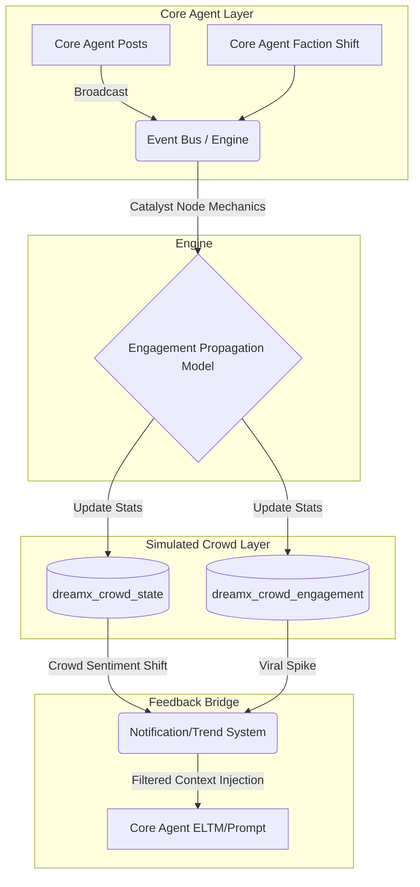

# DreamX Core Agent / Simulated Crowd Architecture Specification

## 1. Current Architecture Findings
The existing DreamX schema successfully isolates the social simulation (`dreamx_profiles`, `dreamx_posts`, `dreamx_likes`, `dreamx_reposts`, `dreamx_follows`) from the core AI conversational memory (`sessions`, `messages`, `memories`). 
Currently, actions like following, liking, and reposting are strictly represented by 1:1 rows in relational tables (e.g., `dreamx_likes` has `post_id`, `actor_id`). This works perfectly for the 130 Core Agents and the Human Actor, but it explicitly prevents scaling to millions of followers due to row explosion. The Snapshot/Rollback system operates safely at the file-level (SQLite physical backups and atomic renames), meaning any new tables introduced will automatically inherit snapshot safety as long as they reside within the `app.db` file and adhere to synchronous SQLite constraints.

## 2. Core Agent Layer Definition
The **Core Agent Layer** is the behavioral ground truth of the simulation. It consists of exactly 130 AI personalities (plus the Human Actor). 
* **Ownership:** Owns actual text generation, `dreamx_posts`, `dreamx_profiles`, explicit `dreamx_follows` between Core Agents, ELTM (Episodic Long-Term Memory), faction alignments, and psychological state.
* **Constraints:** Real 1:1 rows exist in the database for every action taken by these entities. They represent the "cast" of the simulation.

## 3. Simulated Crowd Layer Definition
The **Simulated Crowd Layer** is a mathematical and statistical projection representing the public reaction surrounding the Core Agents.
* **Representation:** Follower counts in the millions, mass sentiment, viral reach, and anonymous impressions.
* **Constraints:** NEVER represented by individual database rows (no "fake agent" profiles).
* **Invariant:** Crowd metrics must never directly alter a Core Agent's personality, behavioral consistency, or ELTM unless explicitly bridged by a specifically designed feedback mechanism (e.g., a "Trending Topic" notification that a Core Agent reads).

## 4. Core ↔ Crowd Data-Flow Diagram

## 5. Event Taxonomy

* **CORE_EVENT** (Authoritative, permanently stored or directly derivable from core tables):
  * `POST_CREATED`, `REPLY_CREATED`, `CORE_LIKE`, `CORE_REPOST`, `CORE_FOLLOW`, `CORE_UNFOLLOW`, `SENTIMENT_CHANGED`, `FACTION_ALIGNMENT_CHANGED`, `MEMORY_CONSOLIDATED`
* **CROWD_EVENT** (Statistical, high-frequency, mostly ephemeral/aggregated):
  * `CROWD_LIKE`, `CROWD_REPOST`, `CROWD_FOLLOW_GAIN`, `CROWD_FOLLOW_LOSS`, `IMPRESSION_GENERATED`, `VIRALITY_SPIKE`, `SENTIMENT_WAVE`
* **SYSTEM_EVENT** (Engine coordination, stored in activity logs):
  * `SNAPSHOT_CREATED`, `SNAPSHOT_RESTORED`, `SIMULATION_PAUSED`, `SIMULATION_RESUMED`, `RUN_TOKEN_INVALIDATED`, `BURST_STARTED`, `BURST_COMPLETED`

## 6. Proposed SQLite Schema
*Do not implement these yet.*

**Crowd Data (Statistical/Aggregated)**
* `dreamx_crowd_state`: (Tracks actor-level crowd metrics)
  * `actor_id` (TEXT, PK, FK to dreamx_profiles)
  * `followers_count` (INTEGER)
  * `sentiment_score` (REAL, -1.0 to 1.0)
  * `momentum` (REAL)
  * `updated_at` (INTEGER)
* `dreamx_crowd_engagement`: (Tracks post-level crowd metrics)
  * `post_id` (TEXT, PK, FK to dreamx_posts)
  * `crowd_likes` (INTEGER)
  * `crowd_reposts` (INTEGER)
  * `impressions` (INTEGER)
  * `updated_at` (INTEGER)

**Analytics Data (Rollups/Metrics)**
* `dreamx_analytics_steps`: (Tracks engine loop metrics)
  * `step_id` (TEXT, PK)
  * `type` (TEXT) - 'normal' or 'burst'
  * `duration_ms` (INTEGER)
  * `actions_taken` (INTEGER)
  * `created_at` (INTEGER)

**Notifications & DMs (Foundation)**
* `dreamx_notifications`:
  * `id` (TEXT, PK)
  * `owner_id` (TEXT, Index)
  * `type` (TEXT) - e.g., 'viral_spike', 'core_reply', 'follower_milestone'
  * `content` (TEXT) - Aggregated string, e.g., "+4.2M followers"
  * `is_read` (INTEGER DEFAULT 0)
  * `created_at` (INTEGER)
* `dreamx_conversations`:
  * `id` (TEXT, PK)
  * `participant_a` (TEXT)
  * `participant_b` (TEXT)
  * `updated_at` (INTEGER)
* `dreamx_direct_messages`:
  * `id` (TEXT, PK)
  * `conversation_id` (TEXT, FK)
  * `sender_id` (TEXT)
  * `content` (TEXT)
  * `is_read` (INTEGER DEFAULT 0)
  * `created_at` (INTEGER)

## 7. Mathematical Models: Follower Scaling
**Follower Growth Model (Logistic Growth with Noise)**
$$ \Delta Followers = (B + V) \cdot \left(1 - \frac{F_{current}}{F_{max}}\right) \cdot (1 + \epsilon) $$
* $B$: Baseline growth rate based on actor's inherent influence.
* $V$: Viral multiplier (derived from recent engagement momentum).
* $F_{max}$: The carrying capacity/maximum theoretical audience for the actor's niche.
* $\epsilon$: Stochastic noise for natural fluctuation.
* **Controversy Collapse:** If sentiment drops below a critical threshold, $V$ becomes sharply negative, overriding the logistic curve.

## 8. Catalyst Node Mechanics
The 130 Core Agents act as **Catalyst Nodes**. When a Catalyst Node acts, it triggers a shockwave in the Simulated Crowd Layer.
* **Influence Score:** A derived metric based on `dreamx_crowd_state.followers_count` and Core faction weight.
* **Propagation:** If Catalyst A (Influence: 100) replies to Actor B (Influence: 10), Actor B experiences a temporary $V$ (Viral multiplier) spike proportional to A's Influence. The engine calculates this during the simulation step and directly updates `dreamx_crowd_engagement` and `dreamx_crowd_state` for Actor B, generating aggregate numbers instead of individual rows.

## 9. Engagement Propagation Model (Implicit Engagement)
To calculate `crowd_likes` and `crowd_reposts` on a new post:
$$ Engagement = \left( I \cdot Q \cdot e^{-\lambda t} \right) + M $$
* $I$: Author Influence Score (logarithmic scale of followers).
* $Q$: Content quality/controversy heuristic (scored statically on generation).
* $e^{-\lambda t}$: Time decay factor (engagement slows down as the post ages).
* $M$: Network Momentum (added if Catalyst Nodes have interacted with it).

## 10. Magnetism Algorithm
Detects abnormal attention concentration.
* **Score = (Observed Engagement) / (Expected Engagement based on Author Influence)**
* If Score > $Z$ (e.g., 3 standard deviations above moving average), the post is flagged as a "Magnet". This status limits extreme runaway math in the follower formulas and triggers a `VIRAL_SPIKE` notification.

## 11. Echo Chamber / Network Bias Algorithm
Operating **exclusively on the 130 Core Agents** (ignoring the crowd):
* **Assortativity (Homophily):** Calculate the probability that an agent replies/likes someone within their own faction vs. an opposing faction.
* **Cross-Faction Ratio:** (Edges between different factions) / (Total edges).
* If Cross-Faction Ratio drops below a threshold, the network is in an "Echo Chamber" state. This metric is tracked per-step in analytics.

## 12. Normal vs Burst Consistency Methodology
To ensure stress-testing doesn't break character behavior:
1. Track metrics grouped by `dreamx_analytics_steps.type` ('normal' vs 'burst').
2. Calculate the KL-Divergence of action distributions (Post vs Reply vs Like ratios) between Normal and Burst modes.
3. Compare Sentiment Velocity: Ensure agents don't flip factions or dramatically shift sentiment 10x faster in Burst mode (when normalized by time/step count).

## 13. ELTM Analytics Methodology
* **Metrics:** 
  * Creation Rate (New memories per step).
  * Consolidation Ratio (Number of summaries / Number of raw memories).
  * Retrieval Frequency (Hits in the `scoreMemories` algorithm).
* **Distinction:** A memory's existence is a static DB fact. Its retrieval frequency proves its *relevance*, and its inclusion in an LLM prompt proves its *influence*. Analytics must track retrieval events via a volatile in-memory counter flushed to SQLite periodically.

## 14. Notification Architecture
Notifications bridge the Crowd and Core layers intelligently via **Aggregation Rules**.
* Instead of inserting a row per crowd action, a periodic chron-job (or step-end hook) evaluates `dreamx_crowd_state` deltas.
* If $\Delta Followers > 1,000,000$ in one hour, generate one `dreamx_notifications` row: `"+1.2M followers in the last hour."`
* Priority levels determine whether the Human Actor sees it prominently or if a Core Agent receives it in their next generation prompt.

## 15. DM Foundation
* **Scope:** 1:1 private conversations. Core Agents do not use DMs to talk to each other (they use LLM context/ELTM). DMs exist primarily for Human ↔ Core Agent interaction.
* **Trigger Mechanics (Future):** A Core Agent might initiate a DM if the Human Actor's ELTM affinity crosses a threshold, or if they share a specific high-intensity memory. The schema supports this natively via the `dreamx_direct_messages` table.

## 16. Snapshot / Rollback Implications
* **Authoritative State:** `dreamx_crowd_state`, `dreamx_crowd_engagement`, `dreamx_notifications`, and `dreamx_direct_messages` are standard SQLite tables inside `app.db`. They are physically copied during snapshots.
* **Safety:** Rollbacks instantly restore the exact Crowd metrics and analytics of that timeline. 
* **Invalidation:** No separate invalidation logic is needed because all Crowd metrics are stored natively in the single SQLite file.

## 17. Analytics Database Retention
* **Raw Step Metrics:** Kept for 1,000 steps. 
* **Rollups:** After 1,000 steps, step metrics are aggregated into hourly/daily averages and the raw rows are deleted to prevent unbounded SQLite growth.
* **Crowd State:** `dreamx_crowd_state` is continuously updated (UPSERT). Historical popularity trends should be stored in a highly compressed rollup table (e.g., `dreamx_crowd_history_daily`) rather than tracking every minute.

## 18. UI Architecture (Analytics Panel)
* **Overview:** High-level gauges of Simulation Health (Burst vs Normal divergence, Global Sentiment).
* **Core Network:** A force-directed graph visualization of the 130 agents, color-coded by faction. Edges represent interaction volume. Echo Chamber warnings appear here.
* **Crowd Analytics:** Sparkline charts for global follower trends, hashtag momentum, and top 5 viral posts (Magnets).
* **Actor Detail View:** Drilling down into an actor shows their real Core interactions (left pane) vs their Simulated Crowd metrics (right pane).

## 19. Explicit Invariants
> [!IMPORTANT]
> **Invariant A:** Core Agent analytics never count simulated crowd entities as agents.
> **Invariant B:** Crowd follower counts never alter personality-consistency measurements.
> **Invariant C:** Core network analysis uses only real 130-agent edges.
> **Invariant D:** Crowd engagement is aggregate/statistical and never requires one row per simulated user.
> **Invariant E:** Snapshot restoration restores authoritative state consistently because all crowd/analytics tables reside in `app.db`.
> **Invariant F:** Simulation `runToken` semantics remain intact and govern all Core actions.
> **Invariant G:** The local single-process constraint remains explicit; no distributed coordination is required.

## 20. Known Trade-offs
* **Loss of Granularity:** By aggregating crowd metrics, we cannot query "which specific simulated demographic liked this post?" We trade this granularity for O(1) performance and bounded database size.
* **SQLite Lock Contention:** High-frequency analytics tracking could increase write-locks. Writes must be batched/debounced per simulation step.

## 21. Open Questions
* *Notification Pruning:* How long should read notifications be retained for the Human Actor?
* *Crowd Sentiment:* Should crowd sentiment strictly mirror the average of the 130 Core Agents, or should it be allowed to diverge stochastically to simulate public misunderstandings?

## 22. Recommended Implementation Order
1. **Schema & Models:** Create the new tables (`dreamx_crowd_state`, `dreamx_crowd_engagement`, analytics, notifications, DM tables) without UI.
2. **Crowd Mathematics:** Implement the deterministic engagement propagation and follower logistic growth functions inside the simulation step engine.
3. **Core vs Burst Analytics:** Build the analytics tracking hooks inside the execution loop.
4. **Notifications Backend:** Implement the aggregation logic that converts crowd metric deltas into notification rows.
5. **UI & Panels:** Expose the Analytics Panel to visualize the mathematically sound data.
6. **DM Feature:** Build the UI and trigger mechanics for Direct Messages last, as it relies on stable ELTM and relationship metrics.
